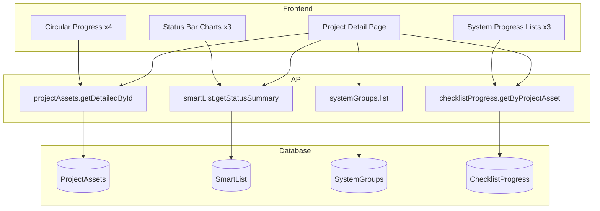

# Project Asset Dashboard Implementation Plan

## Current State Analysis

**What exists:**

- Screen #1 (Project List) is complete with card/table views, filtering, and navigation
- Project detail page at [`apps/web/src/app/(main)/projects/[id]/page.tsx`](apps/web/src/app/(main)/projects/[id]/page.tsx) is a placeholder
- SmartList router with status summary endpoint at [`packages/api/src/routers/smartList.ts`](packages/api/src/routers/smartList.ts)
- IssuesSummary router with system progress endpoint at [`packages/api/src/routers/issuesSummary.ts`](packages/api/src/routers/issuesSummary.ts)

**Key Gap from Backend:**The backend has a fundamentally different data model:

- **SmartList** = Compliance checklist items (15,375 regulatory questions)
- **Issue** = Individual issues/findings (4,882 records)
- Your dev **SmartList** = Action items (simplified task tracker)
- Your dev **IssuesSummary** = Aggregated counts

---

## Schema Changes Required

### 1. Add SystemGroups Lookup Table

Create a reference table for the 15 system groups shown in the dashboard screenshot.**New file:** `packages/api/src/db/schemas/filemaker/generated/SystemGroups.ts`

```typescript
export const SystemGroups = fmTableOccurrence("SystemGroups", {
  id: textField().primaryKey(),
  name: textField(),
  section_id: textField(),     // e.g., "Drilling", "WCE", "Marine"
  section_name: textField(),   // e.g., "Drill Floor", "Well Control Equipment"
  sort_order: numberField(),
});
```

**Seed data** (from backend `Lookup_AG_Rig_Section` and dashboard):| Section | System Groups ||---------|--------------|| SSH&E | SSH&E (Safety, Security, Health, Environment) || Management | Management Systems || Drilling | Lifting/Handling, Drilling Equipment, Drilling Fluid Systems || Fluids | Solids & Gas Treatment || Marine | Marine Systems || WCE | Well Control Equipment, MPD System || Safety | Flare Boom, Power Equipment, Safety Equipment || Service | Service Partner, Life-Saving, Quarters & Helideck |

### 2. Add ChecklistProgress Table

Track completion percentages per system group per project asset for each completion dimension.**New file:** `packages/api/src/db/schemas/filemaker/generated/ChecklistProgress.ts`

```typescript
export const ChecklistProgress = fmTableOccurrence("ChecklistProgress", {
  id: textField().primaryKey(),
  project_asset_id: textField(),
  system_group_id: textField(),
  // Three completion dimensions
  raptor_total: numberField(),
  raptor_complete: numberField(),
  doc_total: numberField(),
  doc_complete: numberField(),
  sit_total: numberField(),
  sit_complete: numberField(),
  // Last updated
  updated_at: timestampField(),
});
```


### 3. Extend SmartList for Checklist vs Action Items

Add a `type` field to distinguish checklist items from action items:**Update:** `packages/api/src/db/schemas/filemaker/generated/SmartList.ts`

```typescript
// Add these fields:
type: textField(),           // "CHECKLIST" | "ACTION"
result_status: textField(),  // "Remaining" | "Closed" | "Non-Conforming" | "Not Applicable" | "Deferred"
```


### 4. Add ActionItems Table (Optional - Alternative to SmartList type field)

If cleaner separation is preferred, create a dedicated ActionItems table matching the dashboard's "Action Item Status" and "Action Item Completion Requirement" cards.---

## API Router Changes

### 1. New Router: `systemGroupsRouter`

**File:** `packages/api/src/routers/systemGroups.ts`

```typescript
export const systemGroupsRouter = {
  list: protectedProcedure.handler(async () => {
    // Return all system groups with their sections
  }),
};
```


### 2. Extend `projectAssetsRouter` with Detail Endpoint

**File:** `packages/api/src/routers/projectAssets.ts`Add a `getDetailedById` procedure that returns:

- Project/Asset basic info
- All completion metrics
- Checklist item counts by status
- Action item counts by priority/status/milestone
- System group progress arrays

### 3. Extend `smartListRouter` for Dashboard Queries

Add procedures:

- `getChecklistStatusSummary(project_asset_id)` - Returns counts by result_status
- `getBySystemGroup(project_asset_id)` - Returns progress per system group
- `getByMilestone(project_asset_id)` - Returns counts by milestone_target

---

## Frontend Components Required

### 1. Circular Progress Indicator Component

**File:** `apps/web/src/components/circular-progress.tsx`A donut chart component for:

- RAPTOR Overall Completion
- RAPTOR Checklist
- System Integration Test Completion
- Document Verification Completion

### 2. Checklist Status Bar Chart

**File:** `apps/web/src/components/charts/checklist-status-chart.tsx`Horizontal bar chart showing:

- Remaining (blue)
- Closed (green)
- Non-Conforming (red)
- Not Applicable (gray)
- Deferred (yellow)
- Total

### 3. Action Item Status Chart

**File:** `apps/web/src/components/charts/action-item-status-chart.tsx`Grouped bar chart by priority (High/Medium/Low) with Open/Closed bars.

### 4. System Progress List Component

**File:** `apps/web/src/components/system-progress-list.tsx`Horizontal progress bars for each system group with percentage labels.

### 5. Project Asset Detail Page

**File:** `apps/web/src/app/(main)/projects/[id]/page.tsx`Layout matching the screenshot:

```javascript
┌─────────────────────────────────────────────────────────────────────┐
│  Row 1: Four Circular Progress Indicators                          │
│  [Overall] [RAPTOR Checklist] [SIT Completion] [Doc Verification]   │
├─────────────────────────────────────────────────────────────────────┤
│  Row 2: Three Status Cards                                          │
│  [Checklist Status] [Action Item Status] [Action Item by Milestone] │
├─────────────────────────────────────────────────────────────────────┤
│  Row 3: Three System Progress Lists                                 │
│  [Doc Verification/System] [Checklist/System] [SIT/System]          │
└─────────────────────────────────────────────────────────────────────┘
```

---

## Implementation Phases

### Phase 1: Schema & Seed Data (Day 1)

1. Create SystemGroups table schema
2. Seed the 15 system groups from screenshot
3. Add `type` and `result_status` fields to SmartList
4. Run `pnpm typegen` to regenerate types

### Phase 2: API Endpoints (Day 1-2)

1. Create `systemGroupsRouter`
2. Add `getDetailedById` to projectAssetsRouter
3. Extend smartListRouter with dashboard queries
4. Add mock data for testing

### Phase 3: UI Components (Day 2-3)

1. Build CircularProgress component
2. Build ChecklistStatusChart component
3. Build ActionItemStatusChart component
4. Build SystemProgressList component

### Phase 4: Detail Page Assembly (Day 3-4)

1. Build the project detail page layout
2. Wire up data fetching with React Query
3. Add loading states and error handling
4. Test with sample data

### Phase 5: Polish & Testing (Day 4-5)

1. Responsive design adjustments
2. R/Y/G color coding based on thresholds
3. Add navigation back to list view
4. Integration testing

---

## Data Flow Diagram



---

## Key Decisions Needed

1. **Chart Library**: Recommend using Recharts (already common in React) or keeping it simple with CSS-only progress bars for the system lists.
2. **Data Source Strategy**: 

- Option A: Read directly from backend via MCP during development, map to dev schema later
- Option B: Seed dev database with representative sample data for demo

3. **SmartList Type Field**: Add to existing SmartList OR create separate ActionItems table?

---