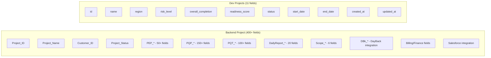
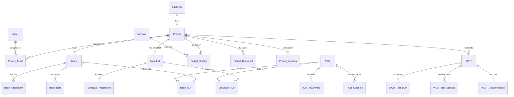

# Athens Backend vs Development Database Comparison

> **Analysis Date:** December 19, 2025  
> **Backend Database:** xDB_AG_iPx.fmp12 (Production Athens System)  
> **Development Database:** athens-web.fmp12 (New Web Application)

---

## Executive Summary

The Athens backend is a **massive, mature FileMaker system** with 10+ years of operational data. The development database is a **simplified abstraction** designed for a modern web dashboard. This analysis reveals significant gaps that must be understood for proper integration.

### Key Findings at a Glance

| Metric | Backend (Production) | Development (New) | Gap |
|--------|---------------------|-------------------|-----|
| **Total Tables** | 190+ | 9 | 181+ tables |
| **Projects** | 596 records, 400+ fields | 3 records, 11 fields | 389+ fields missing |
| **Assets** | 514 records, 14 fields | 3 records, 4 fields | 10 fields missing |
| **Project_Asset(s)** | 598 records, 10 fields | 3 records, 11 fields | Similar structure |
| **SmartList** | 15,375 records, 75+ fields | 5 records, 12 fields | 63+ fields missing |
| **Issue(s)** | 4,882 records, 100+ fields | 4 records (IssuesSummary), 12 fields | Completely different purpose |

---

## Critical Architectural Differences

### 1. SmartList: Checklist Items vs Action Items

**⚠️ MAJOR CONCEPTUAL DIFFERENCE**

| Aspect | Backend SmartList | Dev SmartList |
|--------|------------------|---------------|
| **Purpose** | Compliance checklist items (questions to answer) | Task/action items (things to do) |
| **Record Count** | 15,375 | 5 |
| **Typical Content** | "Does the well control system have a diverter system?" | "Follow up with Acme Inc." |
| **Data Structure** | Complex regulatory compliance framework | Simple task management |

**Backend SmartList is a compliance checklist system:**
- Links to regulatory standards (NORSOK, PTIL, API)
- Has source citations with section references
- Tracks equipment readiness across system groups
- Contains checklist questions with answer choices (OK / N/A / Deviation)
- Organized by Success Criteria, System Groups, Components

**Dev SmartList is a simple action item tracker:**
- Title, description, priority, status
- Assigned to person, due date
- Milestone targets

### 2. Issue vs IssuesSummary: Individual Records vs Aggregates

| Aspect | Backend Issue | Dev IssuesSummary |
|--------|--------------|-------------------|
| **Purpose** | Individual issue records | Aggregated counts by system group |
| **Record Count** | 4,882 | 4 |
| **Granularity** | One record per issue | Summary statistics |
| **Fields** | 100+ detailed fields | 12 summary fields |

**Backend Issue table tracks:**
- Individual problems found during inspections
- Detailed descriptions, equipment, OEM vendors
- Resolution workflow (NEW → ASSIGNED → RESOLVED → CLOSED)
- Originator, owner, dates, client flags
- Traceability, recommendations, change logs

**Dev IssuesSummary tracks:**
- Aggregate counts (open_high, closed_high, open_medium, etc.)
- System progress percentages
- Summary by date and system group

---

## Detailed Field Comparisons

### Project vs Projects



#### Backend Project - Key Field Groups

| Category | Prefix | Description | Field Count |
|----------|--------|-------------|-------------|
| **PEP** | `PEP_*` | Project Execution Plan fields | ~50 |
| **PQP** | `PQP_*` | Project Quality Plan/checklist signoffs | ~150 |
| **PQT** | `PQT_*` | Project Quality Tracking | ~100 |
| **Daily Report** | `DailyReport_*` | Daily status reports | ~20 |
| **Scope** | `Scope_*` | Project scope definitions | ~6 |
| **DBk** | `DBk_*` | DayBack calendar integration | ~10 |
| **Calculated** | `c_*` | Calculated/summary fields | ~50 |
| **Statistics** | `s_*` | Statistical summaries | ~20 |

#### Backend Project Sample Data

```
Project_ID: "16-1225"
Project_Name: "BP PBLJ BOP Acceptance 2015"
Customer_ID: "BP"
ServiceType_ID: "AR_Accept"
Project_Status: "Closed"
Project_Start_Date: "2015-11-29"
Project_End_Date: "2015-12-24"
c_ListOfSurveyors: "Hodnett, Brian (SDM), Donald, Struan"
c_ListOfRigs: "Dolphin Drilling Paul B. Loyd Jr."
PQT_QoS: 2.44 (Quality of Service score)
```

#### Dev Projects Sample Data

```
id: "2BFD5060-1CA7-4CED-A40A-DBDD634E9758"
name: "RAPTOR - Deepwater Horizon II"
region: "Gulf of Mexico"
risk_level: "Medium"
overall_completion: 48
readiness_score: 72
status: "In Progress"
```

---

### Asset vs Assets

| Backend Asset | Dev Assets |
|--------------|------------|
| `Asset_ID` | `id` |
| `Asset_Name` | `name` |
| `Asset_Type` | `type` |
| `Asset_Family_Name` | ❌ Missing |
| `Asset_Name_Short` | ❌ Missing |
| `ListOfSynonyms` | ❌ Missing |
| `Description` | ❌ Missing |
| `Notes` | ❌ Missing |
| `CreationTimestamp` | ❌ Missing |
| `CreatedBy` | ❌ Missing |
| `ModificationTimestamp` | ❌ Missing |
| `ModifiedBy` | ❌ Missing |
| ❌ N/A | `location` |

**Notable Differences:**
- Backend uses human-readable `Asset_ID` (e.g., "PBLJ", "Ocean Victory")
- Dev uses UUID for `id`
- Backend tracks ownership/family (e.g., "Dolphin Drilling", "Diamond Offshore")
- Dev has `location` field not in backend

#### Backend Asset Types Observed
- Semisub (Semi-Submersible)
- Drillship
- Platform
- Jackup

---

### Project_Asset vs ProjectAssets

| Backend Project_Asset | Dev ProjectAssets |
|----------------------|-------------------|
| `Project_Asset_UUID` | `id` |
| `Project_ID` | `project_id` |
| `Asset_ID` | `asset_id` |
| `Notes` | ❌ Missing |
| `ListOf_Rigs` | ❌ Missing |
| `CountOf_Rigs` | ❌ Missing |
| `CountOf_Projects` | ❌ Missing |
| `c_AssetIDWithType` | ❌ Missing |
| ❌ N/A | `raptor_checklist_completion` |
| ❌ N/A | `sit_completion` |
| ❌ N/A | `doc_verification_completion` |
| ❌ N/A | `checklist_remaining` |
| ❌ N/A | `checklist_closed` |
| ❌ N/A | `checklist_non_conforming` |
| ❌ N/A | `checklist_not_applicable` |
| ❌ N/A | `checklist_deferred` |

**Key Insight:** The dev database adds **completion metrics** that don't exist in the backend's junction table. These would need to be calculated from the SmartList and Issue tables in the backend.

---

### SmartList Comparison (CRITICAL)

#### Backend SmartList - Compliance Checklist System

```
Fields: 75+
Records: 15,375

Key Fields:
- SmartList_Item_UUID (primary key)
- Project_ID (e.g., "0-1")
- Checklist_Item_ID (numeric ID)
- Checklist_Question (the actual question text)
- Checklist_Answer_Choice (e.g., "OK | N/A | Deviation")
- SuccessCriteria_ID / SuccessCriteria_Name
- SystemGroup_ID / SystemGroup_Name
- System_ID / System_Name
- Service_Level_ID / Service_Level_Name
- Source_ID / Source_Name / Source_URL / Source_Sections
- Results / Results_Notes / Results_Updated
- Assigned_User_ID / Assigned_Activity / Assigned_Schedule
```

**Sample Record:**
```
Checklist_Question: "Does the well control system have a diverter system?"
SystemGroup_Name: "Well Control Package"
Source_Name: "DRILLING FACILITIES (NORSOK-D-001:1998)"
Source_Sections: "5.10.1"
Checklist_Answer_Choice: "OK | N/A | Deviation"
```

#### Dev SmartList - Action Item Tracker

```
Fields: 12
Records: 5

Key Fields:
- id (UUID)
- project_asset_id (FK)
- title
- description
- priority (High/Medium/Low)
- status (Open/Closed)
- due_date
- milestone_target
- system_group
- assigned_to
```

**Sample Record:**
```
title: "Follow up with Acme Inc."
priority: "Medium"
status: "Open"
milestone_target: "Prior To Sail"
assigned_to: "John Smith"
```

**⚠️ These are fundamentally different data models!**

---

### Issue vs IssuesSummary

#### Backend Issue - Individual Problem Records

```
Fields: 100+
Records: 4,882

Key Fields:
- Issue_UUID (primary key)
- Project_ID
- Issue_ID (sequential number)
- Short_Description
- Priority_ID (H/M/L)
- Type (ISSUE/ACTION/ENHANCEMENT/DEVIATION)
- Status (NEW/ASSIGNED/RESOLVED/CLOSED)
- Resolution (PUNCHLIST/etc.)
- Equipment
- OEM_Vendor
- Originator
- Owner
- Date_Opened / Date_Closed / Date_Status_Changed
- Description (detailed)
- Resolution_Notes
- Primary_System_ID
- Asset
- Client_Flag / Client_Comments
- AthensGroup_Recommendation
```

**Sample Record:**
```
Short_Description: "Mux Clamps damaged whilst Pulling BOP"
Priority_ID: "H"
Type: "ACTION"
Status: "ASSIGNED"
Equipment: "Mux Cable Clamp"
OEM_Vendor: "NOV"
Description: "Odfjell need to look at doubling up their clamps..."
```

#### Dev IssuesSummary - Aggregated Statistics

```
Fields: 12
Records: 4

Key Fields:
- id (UUID)
- project_asset_id (FK)
- summary_date
- total_items
- open_high / closed_high
- open_medium / closed_medium
- open_low / closed_low
- system_group
- system_progress
```

---

## Backend Table Categories (190+ Tables)

### Core Business Tables
| Table | Count | Purpose |
|-------|-------|---------|
| Project | 596 | Main project records |
| Asset | 514 | Physical drilling assets |
| Project_Asset | 598 | Project-Asset assignments |
| Issue | 4,882 | Individual issues/findings |
| SmartList | 15,375 | Compliance checklist items |
| Customer | ? | Client organizations |
| Surveyor | ? | Field surveyors/inspectors |

### Related/Child Tables
- `Issue_Attachment` - File attachments to issues
- `Issue_Note` - Notes on issues
- `Issue_ROR` - Risk of Recurrence links
- `SmartList_Attachment` - Attachments to checklist items
- `SmartList_ROR` - ROR links for checklist items
- `Project_Document` - Project documentation
- `Project_Staffing` - Team assignments
- `Project_Location` - Work locations
- `Project_Checkpoint` - Milestones/checkpoints
- `Project_Deliverable` - Project deliverables

### WCIT (Well Control Integrity Test) System
```
WCIT
WCIT_Documentation
WCIT_EquipChange
WCIT_SOW
WCIT_Test_Acoustic
WCIT_Test_AutoDead
WCIT_Test_BOP
WCIT_Test_EDS
WCIT_Test_Operator
WCIT_Test_ROV_Stab
WCIT_Test_Soak
WCIT_Test_Soak_StartStop
WCIT_Transducer
```

### ROR (Risk of Recurrence) System
```
ROR
ROR_Attachment
ROR_Outcome
```

### Lookup Tables
```
Lookup_AG_Rig_Section
Lookup_AG_Rig_System
Lookup_Issue_Priority
Lookup_Project_Status
Lookup_ServiceType
Lookup_System
Lookup_Vessel_Document
Lookup_Vessel_Personnel
... (20+ more)
```

### Session/UI Tables
```
Session
Session_ActiveProject
Session_ActiveAsset
Session_ActiveIssue
Session_User
... (20+ more)
```

### Integration Tables
```
SF_Opportunity (Salesforce)
SF_Import
Email_Batch
Dayback_User (Calendar)
```

---

## Data Relationship Diagram



---

## Integration Recommendations

### 1. Mapping Strategy

| Dev Table | Backend Source | Integration Approach |
|-----------|---------------|---------------------|
| `Projects` | `Project` | Direct map with field subset |
| `Assets` | `Asset` | Direct map with field subset |
| `ProjectAssets` | `Project_Asset` | Direct map + calculate metrics |
| `SmartList` | `Project_Action_Item` | Map to action items, NOT SmartList |
| `IssuesSummary` | `Issue` (aggregated) | Calculate from Issue table |

### 2. Field Mapping Notes

**Projects → Project:**
```typescript
{
  id: Project_Asset_UUID,        // or generate from Project_ID
  name: Project_Name,
  region: PQP_ProjectInfo_ListOfRegions ?? c_ListOfRigs,
  risk_level: // Calculate from PQP_Risks_* fields
  overall_completion: // Calculate from SmartList results
  readiness_score: PQT_QoS ?? // Calculate
  status: Project_Status,
  start_date: Project_Start_Date,
  end_date: Project_End_Date,
}
```

**IssuesSummary → Issue (Aggregation Query):**
```sql
SELECT 
  project_asset_id,
  summary_date,
  COUNT(*) as total_items,
  SUM(CASE WHEN Priority_ID='H' AND Status!='CLOSED' THEN 1 ELSE 0 END) as open_high,
  SUM(CASE WHEN Priority_ID='H' AND Status='CLOSED' THEN 1 ELSE 0 END) as closed_high,
  ...
FROM Issue
GROUP BY project_asset_id, summary_date
```

### 3. Missing Backend Concepts to Consider

The backend has concepts not yet in the dev database:

1. **Surveyors/Users** - Field personnel management
2. **Customers** - Client organization management  
3. **WCIT Testing** - Well control integrity testing system
4. **ROR (Risk of Recurrence)** - Risk tracking across issues
5. **Document Management** - Attachments, certificates, reports
6. **Bookings/Scheduling** - Resource scheduling
7. **DayBack Integration** - Calendar visualization
8. **Salesforce Integration** - CRM sync
9. **Quality Tracking (PQT)** - Project quality metrics
10. **Project Execution Plans (PEP)** - Detailed project management

---

## Summary: Path Forward

### Immediate Actions

1. **Clarify SmartList Purpose** - Decide if dev SmartList should be:
   - A simplified view of backend SmartList (compliance)
   - OR a new action item system (separate from backend SmartList)
   - Consider using `Project_Action_Item` backend table instead

2. **Calculate Metrics** - The dev `ProjectAssets` completion fields need to be calculated from:
   - Backend `SmartList` results (for checklist completion)
   - Backend `Issue` status/counts (for issue metrics)

3. **Status Mapping** - Backend has more status states:
   ```
   Backend: Verbal, Before Start, In Progress, Completed, Closed, Cancelled
   Dev: Closeable, Verbal, Before Start, In Progress, Completed, Cancelled, Closed, Unknown
   ```

### Future Phases

1. Add customer/client management
2. Add surveyor/team management  
3. Implement document attachments
4. Consider WCIT integration for compliance-heavy projects
5. Build aggregation layer for real-time dashboard metrics

---

## Appendix: Backend Statistics

| Table | Record Count |
|-------|-------------|
| Project | 596 |
| Asset | 514 |
| Project_Asset | 598 |
| SmartList | 15,375 |
| Issue | 4,882 |
| Total Tables | 190+ |

**Data spans:** 2015 - Present (10+ years of operational data)

